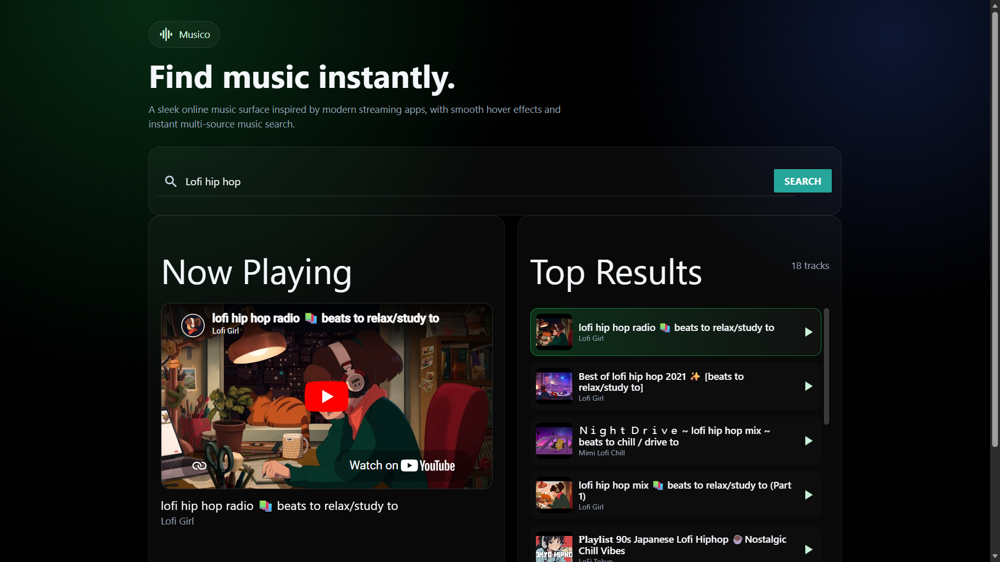
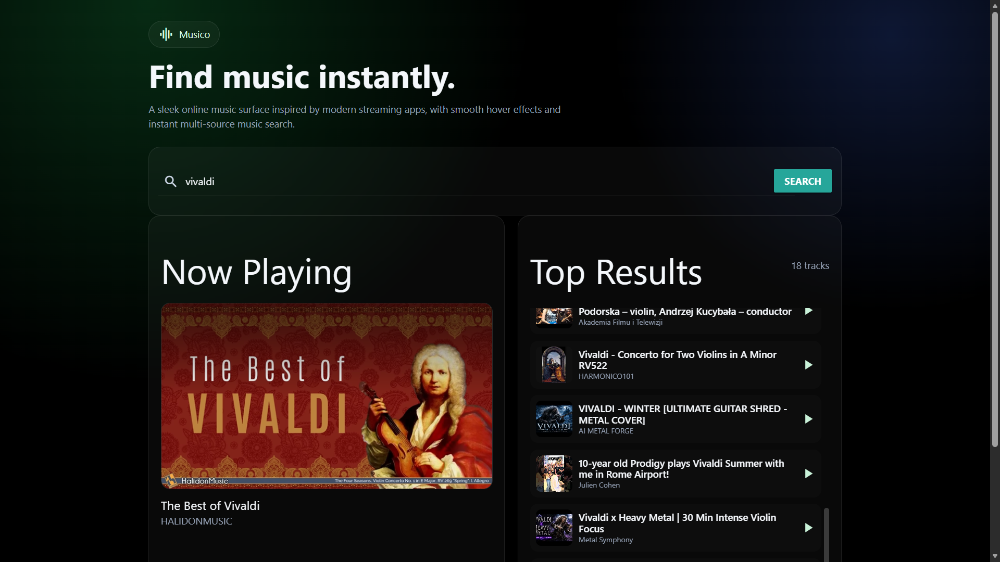
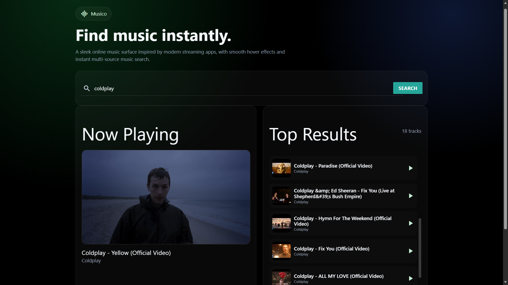

# Musico 🎵

A modern music discovery platform built with Next.js and TypeScript featuring YouTube-powered search, instant playback, responsive UI, and cloud deployment.

## Features

* Instant music search
* YouTube-powered results
* Responsive modern UI
* Embedded playback
* Fast server-side search API
* Vercel cloud deployment

## Tech Stack

* Next.js
* React
* TypeScript
* YouTube Data API
* Brave Search API
* Vercel

## Live Demo

https://musico-ashen.vercel.app/

## Screenshots

### Homepage

## Search Results

## Player View

## Installation

git clone <repository-url>

npm install

npm run dev

## Environment Variables

YOUTUBE_API_KEY=your_key

BRAVE_SEARCH_API_KEY=your_key

ALLOW_PREVIEW_FALLBACK=false

## Future Improvements

* User authentication
* Playlists
* Favorites
* Listening history
* Recommendation engine

## Author

Harshit Pathak

